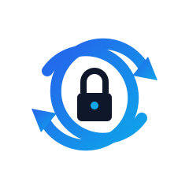
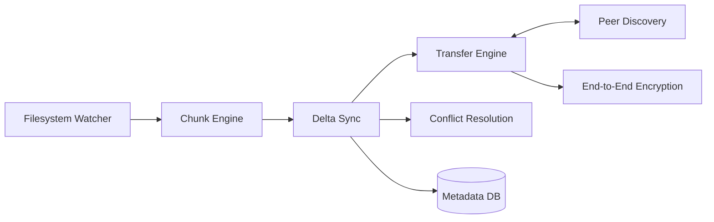

<div align="center">


# SecureSync

**Encrypted peer-to-peer file synchronization engine.**

[](.github/workflows/ci.yml)
[](LICENSE)
[]()
[](https://github.com/psf/black)
[](CODE_OF_CONDUCT.md)
[]()

</div>

> ⚠️ **Project status:** Phase 1 (Filesystem Watcher) and Phase 2 (Chunk
> Engine) are implemented. The sync engine is still early — see
> [ROADMAP.md](ROADMAP.md) for what's next.

---

## Table of Contents

- [What is SecureSync?](#what-is-securesync)
- [Architecture](#architecture)
- [Features](#features)
- [Installation](#installation)
- [Quick Start](#quick-start)
- [Configuration](#configuration)
- [Documentation](#documentation)
- [Benchmarks](#benchmarks)
- [Roadmap](#roadmap)
- [FAQ](#faq)
- [Contributing](#contributing)
- [Security](#security)
- [Community](#community)
- [License](#license)

## What is SecureSync?

SecureSync is a peer-to-peer file synchronization engine: devices discover
each other on the network, establish an authenticated end-to-end encrypted
channel, and synchronize only the parts of files that actually changed. No
central server holds your data.

## Architecture

SecureSync is built with Clean Architecture — domain logic is fully isolated
from infrastructure (filesystem, network, database), which keeps the core
sync/conflict-resolution logic testable and every adapter (transport, cipher,
discovery mechanism) independently swappable.

Full write-up: [docs/architecture.md](docs/architecture.md)



## Features

> Checked items are implemented; unchecked items are planned. Tracked in
> detail in [ROADMAP.md](ROADMAP.md).

- [x] Real-time filesystem watching (create/modify/delete/rename/move)
- [x] Streaming, bounded-memory chunking + SHA-256 hashing (content-defined
      chunking with rolling hash reserved for a later phase — see
      [ADR-0007](docs/adr/0007-chunking-strategy-as-a-pluggable-port.md))
- [ ] Delta synchronization (only changed chunks are transferred)
- [ ] Peer discovery (UDP broadcast + mDNS)
- [ ] Resumable, streamed, compressed transfers over TLS
- [ ] End-to-end encryption: X25519 key exchange, AES-256-GCM /
      ChaCha20-Poly1305, per-session keys, key rotation
- [ ] Conflict resolution with version metadata and conflict files
- [ ] SQLite-backed metadata store (peers, chunks, versions, history)
- [ ] Live CLI dashboard (transfer speed, peer status, logs)
- [ ] YAML + environment variable configuration with hot reload

## Installation

*(Placeholder — will be filled in once the package is published. For now,
during development:)*

```bash
git clone https://github.com/<org>/securesync.git
cd securesync
pip install -e ".[dev]"
```

## Quick Start

*(Placeholder — populated once the CLI exists in Phase 9.)*

## Configuration

The planned YAML schema and environment variable overrides are fully
documented in [docs/configuration.md](docs/configuration.md). Config
*loading* (the actual code) lands in Phase 10 — until then this is a
design reference, not a runnable feature.

## Documentation

| Doc | Covers |
|---|---|
| [docs/architecture.md](docs/architecture.md) | Clean Architecture layers, SOLID, design patterns, tech decisions, diagrams |
| [docs/networking.md](docs/networking.md) | Peer discovery, topology, connection lifecycle |
| [docs/protocol.md](docs/protocol.md) | Binary wire protocol: header layout, packet types, handshake |
| [docs/security.md](docs/security.md) | Cryptographic design and full threat model |
| [docs/performance.md](docs/performance.md) | Benchmark methodology and metrics tracked |
| [docs/development.md](docs/development.md) | Local dev setup, testing conventions |
| [docs/deployment.md](docs/deployment.md) | Docker, docker-compose, systemd, ports |
| [docs/configuration.md](docs/configuration.md) | YAML schema, environment variables, hot reload |
| [docs/troubleshooting.md](docs/troubleshooting.md) | Common issues and diagnostics |
| [docs/adr/](docs/adr/) | Architecture Decision Records |

## Benchmarks

The chunking and hashing benchmarks are implemented — see
[benchmarks/](benchmarks/) and run them yourself with `make benchmark` or
`python -m benchmarks`. Results from the Phase 2 PR are in
[CHANGELOG.md](CHANGELOG.md#unreleased) ("Benchmark results"); transfer
and end-to-end benchmarks are added as those phases land. Methodology is
defined in [docs/performance.md](docs/performance.md).

## Roadmap

See [ROADMAP.md](ROADMAP.md) for the full phase-by-phase plan.

## FAQ

**Why not just use Syncthing?**
SecureSync is an educational, ground-up implementation built to demonstrate
architecture, networking, and cryptography engineering practices — not a
drop-in Syncthing replacement (yet).

**Is the cryptography audited?**
SecureSync only uses well-established primitives from the audited `cryptography`
(pyca) library — see [docs/security.md](docs/security.md) for the full
threat model. The *composition* of those primitives into a protocol is not
independently audited; do not rely on this project for production secrecy
guarantees before that happens.

## Contributing

See [CONTRIBUTING.md](CONTRIBUTING.md) for the development workflow,
coding standards, and commit conventions. Good entry points are labeled
`good-first-issue` once the issue tracker is seeded.

## Security

See [SECURITY.md](SECURITY.md) for how to privately report a
vulnerability, and [docs/security.md](docs/security.md) for the full
cryptographic design and threat model.

## Community

- [Code of Conduct](CODE_OF_CONDUCT.md)
- [Issue templates](.github/ISSUE_TEMPLATE/) — bug reports and feature requests
- [Pull request template](.github/PULL_REQUEST_TEMPLATE.md)
- [Architecture Decision Records](docs/adr/) — the "why" behind every major decision

## License

[MIT](LICENSE)
