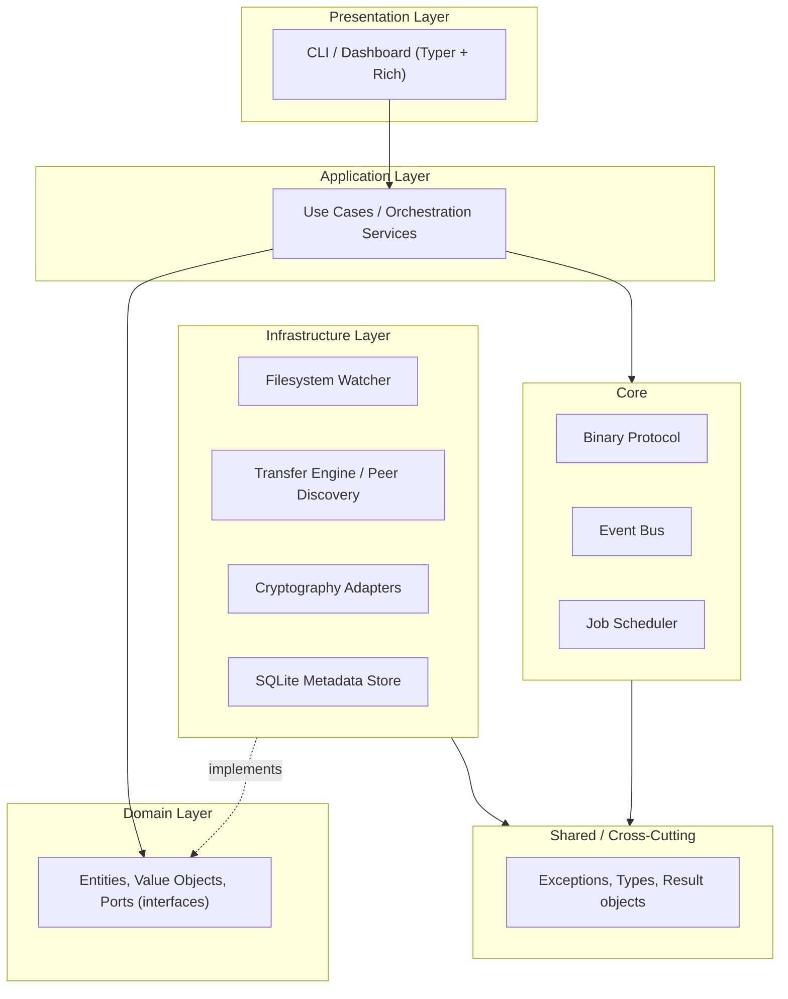
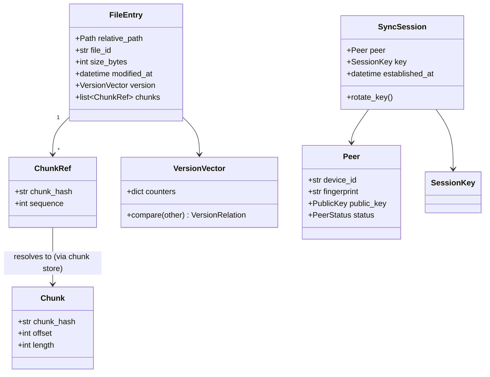
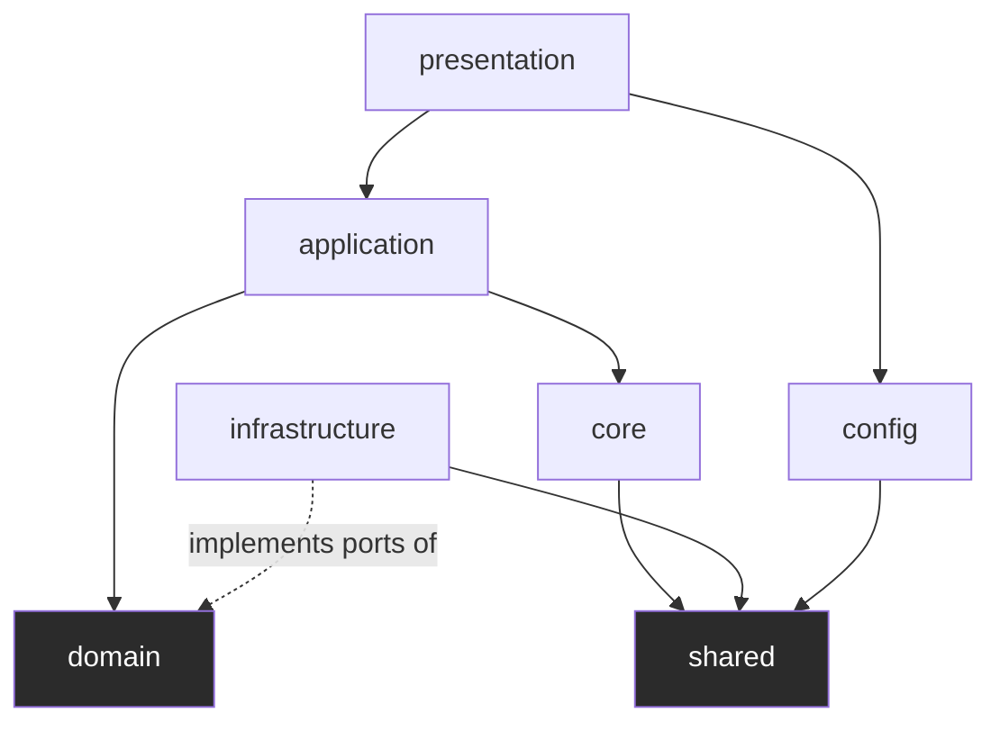
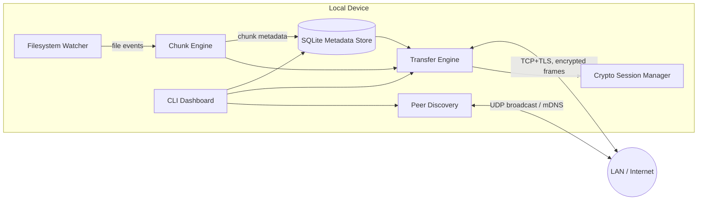
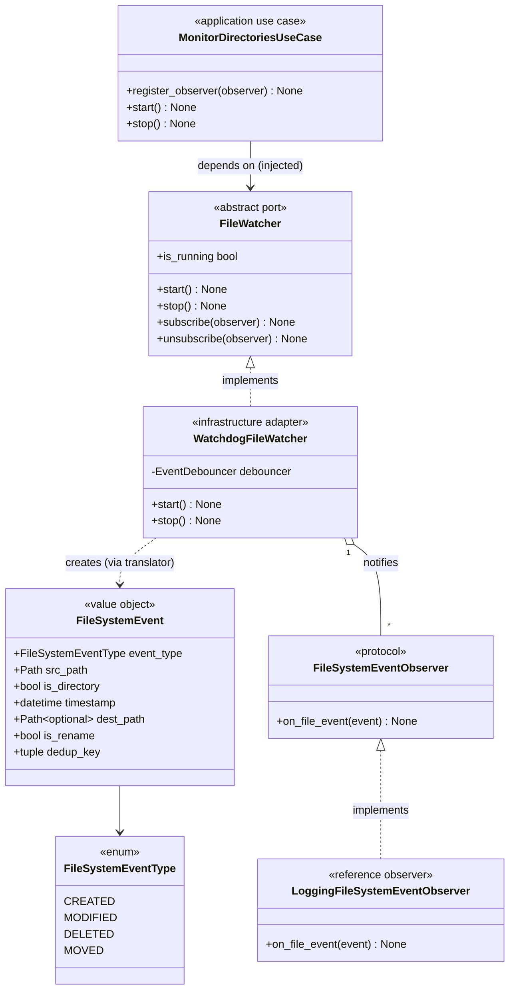
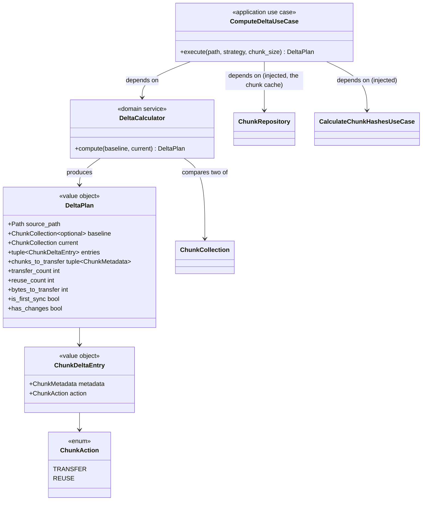

# Architecture

> Status: **Design, Phases 1–3 implemented** — Phase 0/0.5 established this
> document; it is updated at the end of every subsequent phase to reflect
> what was actually built. Phase 1 (Filesystem Watcher), Phase 2 (Chunk
> Engine), and Phase 3 (Delta Synchronization) have real code; everything
> else below is still the design for phases not yet started.

## 1. Architectural Style

SecureSync follows **Clean Architecture** (Hexagonal / Ports & Adapters family).
The dependency rule is: **source code dependencies only point inward.**

**Why this style, and not a simpler layered or microservice approach:**

- SecureSync's domain logic (conflict resolution, chunk diffing, versioning
  rules) must stay testable **without** a real filesystem, a real socket, or a
  real SQLite file. Clean Architecture makes that possible by defining the
  domain in terms of *ports* (interfaces) that infrastructure adapters
  implement.
- A single-process, single-binary tool doesn't benefit from microservice
  overhead (network calls between internal components, deployment
  complexity) — the modularity we need is at the *code* level, not the
  *process* level.
- Every core module in the spec (Watcher, Chunk Engine, Transfer Engine,
  Encryption, Conflict Resolution) is independently swappable: e.g. AES-GCM
  can be replaced by ChaCha20-Poly1305 without touching application or domain
  code, because encryption is a port implemented by an infrastructure
  adapter.

## 2. Layers

| Layer | Responsibility | Depends on |
|---|---|---|
| `presentation/` | CLI commands, live dashboard, output formatting | `application/` |
| `application/` | Use-case orchestration (e.g. `SyncFolderUseCase`, `ChunkFileUseCase` ✅, `ComputeDeltaUseCase` ✅), DTOs | `domain/` |
| `domain/` | Entities (`FileEntry`, `Chunk` ✅, `Peer`), value objects, port interfaces (`FileWatcher` ✅, `ChunkReader`/`ChunkHasher`/`ChunkWriter`/`ChunkRepository`/`ChunkingStrategy` ✅, `TransferChannel`, `PeerRepository`); domain services (`DeltaCalculator` ✅) | nothing (pure Python) |
| `infrastructure/` | Concrete adapters: `WatchdogFileWatcher` ✅, `StreamingChunkReader`/`SHA256HashProvider`/`ChunkFileWriter`/`FileChunkRepository` ✅, `TCPTransferChannel`, `SQLitePeerRepository`, `X25519KeyExchange` | `domain/`, `shared/` |
| `core/` | Cross-module engineering concerns: the binary wire protocol, an internal event bus, a job scheduler | `shared/` |
| `shared/` | Exceptions, common types, `Result`/`Either`-style wrappers, constants | nothing |
| `config/` | YAML + environment variable loading, validation, hot reload | `shared/` |
| `utils/` | Small, stateless, generic helpers (byte formatting, path helpers, the `iter_in_thread` async bridge ✅) | nothing |

## 3. SOLID Principles — how they show up here

- **Single Responsibility** — e.g. the Filesystem Watcher only detects
  events; it never decides what to *do* about them. That decision belongs to
  an application-layer use case.
- **Open/Closed** — new hashing algorithms, transport protocols, or discovery
  mechanisms can be added as new adapters implementing an existing domain
  port, without modifying the port or the use cases that depend on it.
- **Liskov Substitution** — any `TransferChannel` implementation (TCP now,
  QUIC later) must be substitutable without breaking the caller's
  expectations (same async streaming contract).
- **Interface Segregation** — ports are kept narrow (`ChunkHasher` only
  hashes; it does not also know how to transfer or persist).
- **Dependency Inversion** — `application/` and `domain/` depend on
  abstractions defined *in* `domain/`; `infrastructure/` depends on those
  same abstractions. Dependency Injection wires the concrete adapters in at
  the composition root (the CLI entry point).

## 4. Design Patterns planned (by module, introduced when that phase lands)

| Pattern | Where | Why |
|---|---|---|
| Observer ✅ *(implemented, Phase 1)* | `FileWatcher` (subject) → `FileSystemEventObserver` implementations (subscribers) | Multiple consumers (chunker, DB indexer, logger) react to the same filesystem event without the watcher knowing about them. Wiring today is direct `subscribe`/`unsubscribe` on the watcher port; consumers may be re-wired through the `core/` event bus once it exists, without changing the port itself. |
| Strategy ✅ *(implemented, Phase 2, for chunking)* | `ChunkingStrategy` (port) → `FixedSizeChunkingStrategy` (only adapter so far) | Chunk-boundary decisions are pluggable: a future content-defined strategy (rolling hash / Rabin fingerprint / FastCDC) is a new adapter behind the same port — see ADR-0007. Encryption ciphers and compression algorithms are planned future uses of the same pattern, at their own ports, once those phases land. |
| Repository 🟡 *(partially implemented, Phase 2 — temporary adapter)* | `ChunkRepository` (port) → `FileChunkRepository` (JSON-on-disk, temporary) now; a SQLite-backed adapter behind the same port lands in Phase 8; reused unchanged in Phase 3 as the delta-sync chunk cache — see ADR-0009 | Isolates manifest-storage technology from domain/application logic; the eventual metadata database swap-in requires no change to any caller |
| Domain Service ✅ *(implemented, Phase 3, for delta comparison)* | `DeltaCalculator` (`domain/delta.py`) | Content-hash comparison across two manifests doesn't belong to any single entity (it's not "a `Chunk`'s" behavior or "a `ChunkCollection`'s" behavior — it relates *two* of them), so it's modeled as a stateless domain service rather than forced onto an entity or pushed up into the application layer — see ADR-0009 |
| Factory | Peer connection creation | Centralize the construction of authenticated, encrypted peer sessions |
| Command | CLI actions | Each CLI action is an isolated, testable object |
| Chain of Responsibility | Protocol packet handling | Header validation → decryption → decompression → dispatch, each stage independent |

*(Patterns not yet marked ✅/🟡 are listed here as the plan; each is only
actually introduced in the phase where its module is implemented — see
`ROADMAP.md`.)*

## 5. Technology Decisions

| Concern | Choice | Why (and what was rejected) |
|---|---|---|
| Async runtime | `asyncio` (stdlib) ✅ *(in use since Phase 1)* | No extra dependency; sufficient for socket + filesystem I/O concurrency; `trio` would add a second async ecosystem to support for no functional gain here |
| Filesystem events | `watchdog` ✅ *(implemented, Phase 1)* | Mature, cross-platform (inotify/FSEvents/ReadDirectoryChangesW), avoids hand-rolling OS-specific polling |
| Chunk hashing | `hashlib` (stdlib) ✅ *(implemented, Phase 2)* | SHA-256 only, via the standard library exclusively — no custom or third-party crypto for something this security-sensitive; `hashlib`'s C implementation is fast enough that a compiled alternative (e.g. a Rust binding) isn't justified for this phase |
| Wire payload encoding | `msgpack` | Compact binary encoding, fast, language-agnostic (keeps the protocol implementable in other languages later) |
| Config/CLI-facing data | `orjson` ✅ *(implemented, Phase 2, for the chunk manifest)* | Fast JSON where human-readable/debuggable data matters more than wire compactness |
| Cryptography | `cryptography` (pyca) | Audited, maintained by a dedicated security-focused team, wraps OpenSSL/BoringSSL primitives — never hand-rolled crypto |
| Metadata storage | `sqlite3` (stdlib) | Zero-ops embedded database, transactional, sufficient for per-device metadata (peers, chunks, versions) — `FileChunkRepository` (Phase 2) is a temporary filesystem-backed stand-in behind the same port until this lands |
| CLI framework | `Typer` | Type-hint-driven, minimal boilerplate, built on Click |
| Terminal UI | `Rich` | Progress bars, live-updating tables for the dashboard |

## 6. Additional diagrams

### 6.1 Class diagram — core domain entities

`FileEntry`, `Chunk`, `Peer`, and `VersionVector` are domain entities/value
objects — they contain no I/O and no framework dependency, which is what
lets them be unit tested in isolation.

### 6.2 Package diagram — module dependency direction

Arrows represent **allowed** import directions. `domain` has no outgoing
arrow to any other package — this is enforced by code review today; an
automated `import-linter` rule in CI to enforce it mechanically is still
planned for a future phase, not yet added.

### 6.3 Component diagram — runtime components

### 6.4 Class diagram — Filesystem Watcher (Phase 1, implemented)

`FileWatcher` and `FileSystemEventObserver` live in `domain/watcher.py` and
have zero knowledge of `watchdog`. `WatchdogFileWatcher`
(`infrastructure/filesystem/watchdog_watcher.py`) is the only module in the
codebase that imports `watchdog`; it translates raw `watchdog` events into
`FileSystemEvent` value objects, debounces duplicates, and dispatches them
asynchronously (via `asyncio.run_coroutine_threadsafe`, since `watchdog`
runs its own OS thread) to every subscribed observer.
`MonitorDirectoriesUseCase` (`application/use_cases/monitor_directories.py`)
owns the watcher's lifecycle and is the composition point where a concrete
`FileWatcher` is injected — application code never imports
`WatchdogFileWatcher` directly.

### 6.5 Class diagram — Chunk Engine (Phase 2, implemented)

```mermaid
classDiagram
    class Chunk {
        <<value object>>
        +ChunkMetadata metadata
        +bytes data
        +with_hash(hash) Chunk
    }
    class ChunkMetadata {
        <<value object>>
        +str chunk_id
        +int index
        +int size
        +int offset
        +ChunkHash~optional~ chunk_hash
        +datetime created_at
    }
    class ChunkHash {
        <<value object>>
        +ChunkAlgorithm algorithm
        +str digest
    }
    class ChunkCollection {
        <<value object>>
        +Path source_path
        +int chunk_size
        +int total_size
        +tuple~ChunkMetadata~ chunks
    }
    class ChunkingStrategy {
        <<abstract port>>
        +next_cut(buffered, at_eof) int
        +preferred_read_block_size int
        +name str
    }
    class ChunkReader {
        <<abstract port>>
        +read_chunks(path, strategy) Iterator~Chunk~
    }
    class ChunkHasher {
        <<abstract port>>
        +hash(data) ChunkHash
    }
    class ChunkWriter {
        <<abstract port>>
        +write_chunk(destination, chunk) None
    }
    class ChunkRepository {
        <<abstract port>>
        +save(collection) None
        +load(source_path) ChunkCollection
    }
    class FixedSizeChunkingStrategy {
        <<infrastructure adapter>>
        -int chunk_size
    }
    class StreamingChunkReader {
        <<infrastructure adapter>>
    }
    class SHA256HashProvider {
        <<infrastructure adapter>>
    }
    class ChunkFileWriter {
        <<infrastructure adapter>>
    }
    class FileChunkRepository {
        <<infrastructure adapter, temporary>>
    }
    class ChunkFileUseCase {
        <<application use case>>
        +execute(path, strategy) AsyncIterator~Chunk~
    }
    class VerifyChunkUseCase {
        <<application use case>>
        +execute(chunk) bool
    }
    class CalculateChunkHashesUseCase {
        <<application use case>>
        +execute(path, strategy) AsyncIterator~ChunkMetadata~
        +build_manifest(path, strategy, chunk_size) ChunkCollection
    }

    ChunkingStrategy <|.. FixedSizeChunkingStrategy : implements
    ChunkReader <|.. StreamingChunkReader : implements
    ChunkHasher <|.. SHA256HashProvider : implements
    ChunkWriter <|.. ChunkFileWriter : implements
    ChunkRepository <|.. FileChunkRepository : implements
    Chunk --> ChunkMetadata
    ChunkMetadata --> ChunkHash
    ChunkCollection --> ChunkMetadata
    ChunkFileUseCase --> ChunkReader : depends on (injected)
    ChunkFileUseCase --> ChunkHasher : depends on (injected)
    VerifyChunkUseCase --> ChunkHasher : depends on (injected)
    CalculateChunkHashesUseCase --> ChunkReader : depends on (injected)
    CalculateChunkHashesUseCase --> ChunkHasher : depends on (injected)
```

Every port in `domain/chunking.py` has zero knowledge of `hashlib`,
`readinto()`, or any I/O — `StreamingChunkReader` and `SHA256HashProvider`
(`infrastructure/chunking/`) are the only modules that touch a real file or
import `hashlib`. All three use cases (`application/use_cases/`) are
`async def`, but the ports and adapters they depend on are plain
synchronous generators — see ADR-0008 for why, and
`utils/async_iter.iter_in_thread` for the bridge between the two. See
ADR-0007 for why `ChunkingStrategy` is pull-based rather than size-based.

### 6.6 Class diagram — Delta Sync (Phase 3, implemented)

`DeltaCalculator` takes no constructor arguments and holds no state — every
call to `compute` is a pure function of its two arguments. It matches
chunks by `ChunkHash` equality across the whole baseline (a `frozenset`
membership test per current chunk), not by `ChunkMetadata.index`, so a
chunk that changed position without changing content is still classified
`REUSE` — see ADR-0009. No new port was introduced: `ComputeDeltaUseCase`
depends on the same `ChunkRepository` port from Phase 2 as its chunk
cache.

## 7. Non-functional targets carried from Phase 0 onward

- Stream all file I/O — never load a full file into memory (files may
  exceed 100GB). ✅ *(verified, Phase 2: `StreamingChunkReader` reads in
  bounded blocks regardless of file size; see the peak-memory tests in
  `tests/chunking/` and the benchmark results in `CHANGELOG.md`.)*
- All network-facing code is `async`.
- Every cryptographic primitive is from `cryptography` (pyca); nothing is
  hand-rolled. See `docs/security.md` (added when the encryption phase lands).
