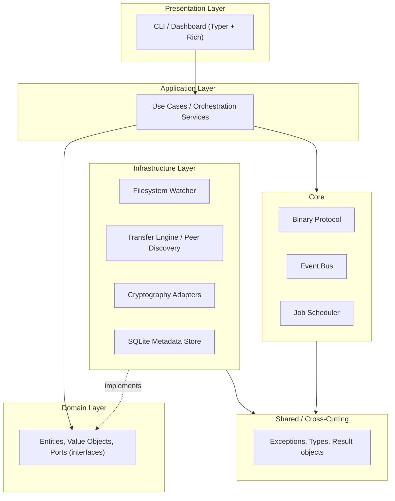
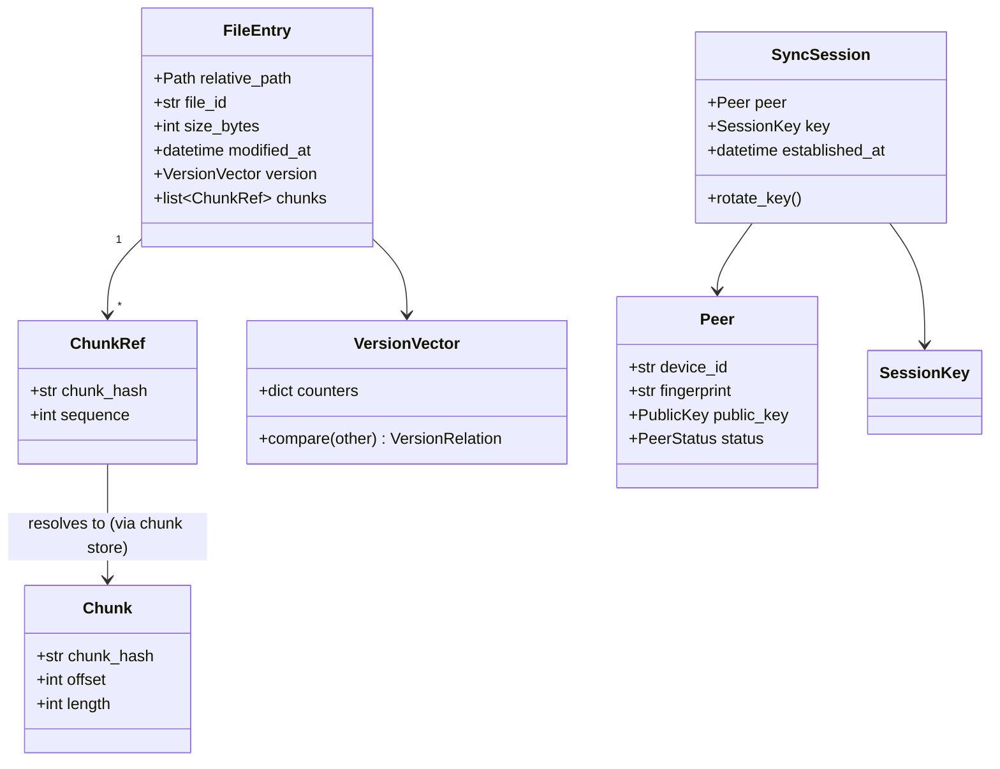
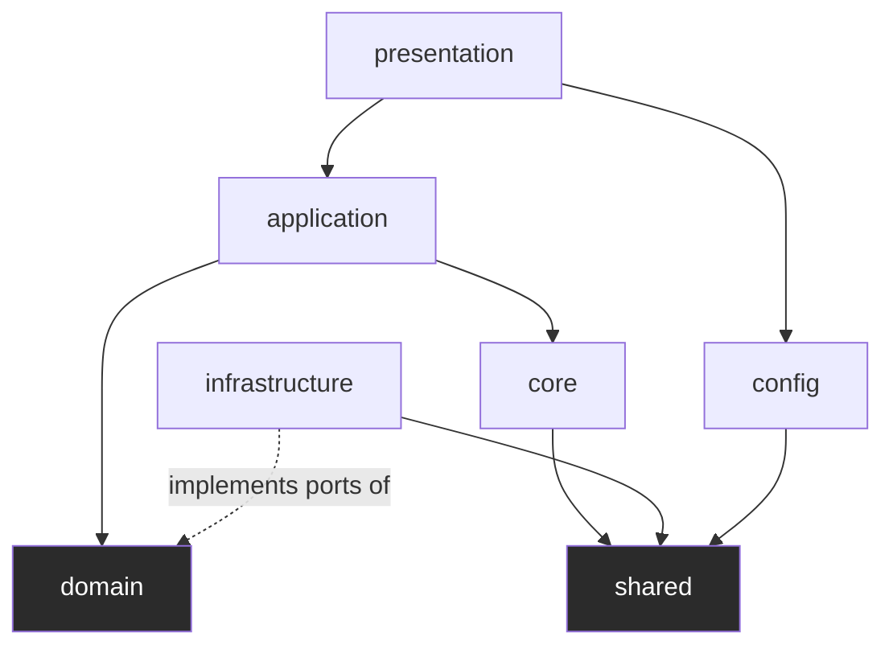
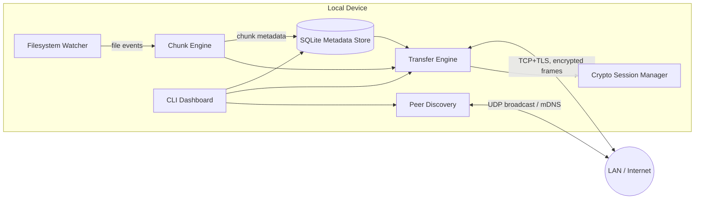

# Architecture

> Status: **Design** — Phase 0/0.5 established this document; it is updated
> at the end of every subsequent phase to reflect what was actually built.

## 1. Architectural Style

SecureSync follows **Clean Architecture** (Hexagonal / Ports & Adapters family).
The dependency rule is: **source code dependencies only point inward.**

**Why this style, and not a simpler layered or microservice approach:**

- SecureSync's domain logic (conflict resolution, chunk diffing, versioning
  rules) must stay testable **without** a real filesystem, a real socket, or a
  real SQLite file. Clean Architecture makes that possible by defining the
  domain in terms of *ports* (interfaces) that infrastructure adapters
  implement.
- A single-process, single-binary tool doesn't benefit from microservice
  overhead (network calls between internal components, deployment
  complexity) — the modularity we need is at the *code* level, not the
  *process* level.
- Every core module in the spec (Watcher, Chunk Engine, Transfer Engine,
  Encryption, Conflict Resolution) is independently swappable: e.g. AES-GCM
  can be replaced by ChaCha20-Poly1305 without touching application or domain
  code, because encryption is a port implemented by an infrastructure
  adapter.

## 2. Layers

| Layer | Responsibility | Depends on |
|---|---|---|
| `presentation/` | CLI commands, live dashboard, output formatting | `application/` |
| `application/` | Use-case orchestration (e.g. `SyncFolderUseCase`), DTOs | `domain/` |
| `domain/` | Entities (`FileEntry`, `Chunk`, `Peer`), value objects, port interfaces (`ChunkHasher`, `TransferChannel`, `PeerRepository`) | nothing (pure Python) |
| `infrastructure/` | Concrete adapters: `WatchdogFileWatcher`, `TCPTransferChannel`, `SQLitePeerRepository`, `X25519KeyExchange` | `domain/`, `shared/` |
| `core/` | Cross-module engineering concerns: the binary wire protocol, an internal event bus, a job scheduler | `shared/` |
| `shared/` | Exceptions, common types, `Result`/`Either`-style wrappers, constants | nothing |
| `config/` | YAML + environment variable loading, validation, hot reload | `shared/` |
| `utils/` | Small, stateless, generic helpers (byte formatting, path helpers) | nothing |

## 3. SOLID Principles — how they show up here

- **Single Responsibility** — e.g. the Filesystem Watcher only detects
  events; it never decides what to *do* about them. That decision belongs to
  an application-layer use case.
- **Open/Closed** — new hashing algorithms, transport protocols, or discovery
  mechanisms can be added as new adapters implementing an existing domain
  port, without modifying the port or the use cases that depend on it.
- **Liskov Substitution** — any `TransferChannel` implementation (TCP now,
  QUIC later) must be substitutable without breaking the caller's
  expectations (same async streaming contract).
- **Interface Segregation** — ports are kept narrow (`ChunkHasher` only
  hashes; it does not also know how to transfer or persist).
- **Dependency Inversion** — `application/` and `domain/` depend on
  abstractions defined *in* `domain/`; `infrastructure/` depends on those
  same abstractions. Dependency Injection wires the concrete adapters in at
  the composition root (the CLI entry point).

## 4. Design Patterns planned (by module, introduced when that phase lands)

| Pattern | Where | Why |
|---|---|---|
| Observer | Filesystem Watcher → Event Bus | Multiple consumers (chunker, DB indexer, logger) react to the same filesystem event without the watcher knowing about them |
| Strategy | Encryption ciphers, compression algorithms | Swap AES-256-GCM ↔ ChaCha20-Poly1305, or compression on/off, behind one interface |
| Repository | Metadata database access | Isolate SQLite-specific code from domain/application logic |
| Factory | Peer connection creation | Centralize the construction of authenticated, encrypted peer sessions |
| Command | CLI actions | Each CLI action is an isolated, testable object |
| Chain of Responsibility | Protocol packet handling | Header validation → decryption → decompression → dispatch, each stage independent |

*(Patterns are listed here as the plan; each is only actually introduced in
the phase where its module is implemented — see `ROADMAP.md`.)*

## 5. Technology Decisions

| Concern | Choice | Why (and what was rejected) |
|---|---|---|
| Async runtime | `asyncio` (stdlib) | No extra dependency; sufficient for socket + filesystem I/O concurrency; `trio` would add a second async ecosystem to support for no functional gain here |
| Filesystem events | `watchdog` | Mature, cross-platform (inotify/FSEvents/ReadDirectoryChangesW), avoids hand-rolling OS-specific polling |
| Wire payload encoding | `msgpack` | Compact binary encoding, fast, language-agnostic (keeps the protocol implementable in other languages later) |
| Config/CLI-facing data | `orjson` | Fast JSON where human-readable/debuggable data matters more than wire compactness |
| Cryptography | `cryptography` (pyca) | Audited, maintained by a dedicated security-focused team, wraps OpenSSL/BoringSSL primitives — never hand-rolled crypto |
| Metadata storage | `sqlite3` (stdlib) | Zero-ops embedded database, transactional, sufficient for per-device metadata (peers, chunks, versions) |
| CLI framework | `Typer` | Type-hint-driven, minimal boilerplate, built on Click |
| Terminal UI | `Rich` | Progress bars, live-updating tables for the dashboard |

## 6. Additional diagrams

### 6.1 Class diagram — core domain entities

`FileEntry`, `Chunk`, `Peer`, and `VersionVector` are domain entities/value
objects — they contain no I/O and no framework dependency, which is what
lets them be unit tested in isolation.

### 6.2 Package diagram — module dependency direction

Arrows represent **allowed** import directions. `domain` has no outgoing
arrow to any other package — this is enforced by code review (and, from
Phase 1 onward, by an import-linter rule in CI) as the single most important
architectural invariant in the codebase.

### 6.3 Component diagram — runtime components

## 7. Non-functional targets carried from Phase 0 onward

- Stream all file I/O — never load a full file into memory (files may exceed 100GB).
- All network-facing code is `async`.
- Every cryptographic primitive is from `cryptography` (pyca); nothing is
  hand-rolled. See `docs/security.md` (added when the encryption phase lands).
