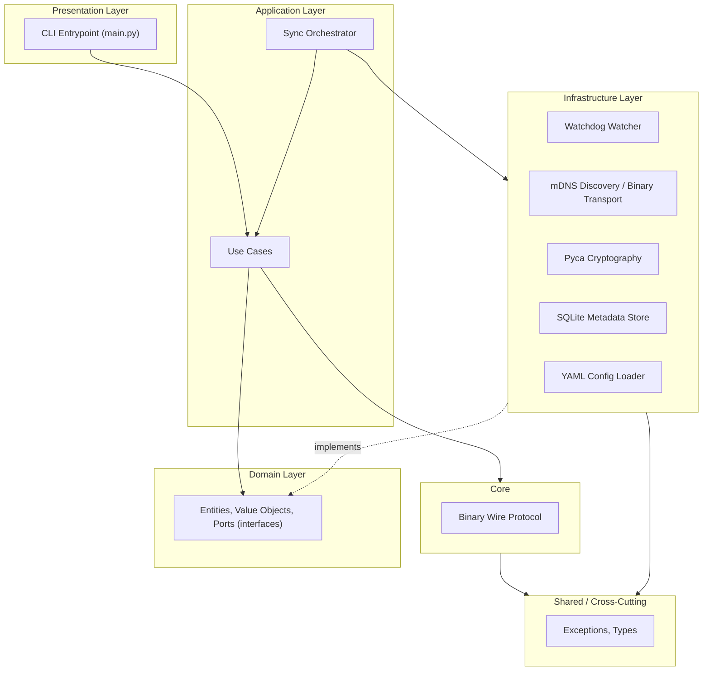

# Architecture

> Status: **Phases 1–10 fully implemented** — This document reflects the
> current production-ready architecture of SecureSync, including peer
> discovery, encrypted transfers, conflict resolution, and the SQLite
> metadata store.

## 1. Architectural Style

SecureSync follows **Clean Architecture** (Hexagonal / Ports & Adapters family).
The dependency rule is: **source code dependencies only point inward.**

## 2. Layers

| Layer | Responsibility | Depends on |
|---|---|---|
| `presentation/` | CLI entry point, bootstrap process | `application/`, `infrastructure/` |
| `application/` | Use-case orchestration (e.g., `SyncOrchestrator` ✅, `ResolveConflictUseCase` ✅, `DownloadChunksUseCase` ✅) | `domain/` |
| `domain/` | Entities (`Peer` ✅, `FileMetadata` ✅, `VersionVector` ✅), port interfaces (`MetadataRepository` ✅, `DiscoveryService` ✅, `TransferTransport` ✅ — concrete adapter: `InProcessTransferTransport`, same-process peer pairs only; no socket transport yet, see ADR-0016 —, `ConflictRepository` ✅) | nothing (pure Python) |
| `infrastructure/` | Concrete adapters: `MdnsDiscoveryService` ✅, `SqliteMetadataRepository` ✅, `PycaCrypto` ✅, `YamlConfigLoader` ✅ | `domain/`, `shared/` |
| `core/` | Cross-module concerns: `protocol.py` ✅ (binary wire protocol) | `shared/` |
| `shared/` | Exceptions, common types | nothing |

## 3. SOLID Principles — how they show up here

- **Single Responsibility**: The `SyncOrchestrator` coordinates components but doesn't implement their logic. Hashing, encryption, and persistence are all in separate modules.
- **Open/Closed**: New merge strategies or transport protocols can be added by implementing new adapters for existing domain ports.
- **Dependency Inversion**: High-level use cases depend on domain ports; low-level infrastructure adapters implement those ports.

## 4. Design Patterns

| Pattern | Where | Why |
|---|---|---|
| Observer ✅ | `FileWatcher` → `FileSystemEventObserver` | Multiple consumers react to filesystem events asynchronously. |
| Strategy ✅ | `ChunkingStrategy`, `MergeStrategy`, `AeadCipher` | Pluggable algorithms for chunking, conflict resolution, and encryption. |
| Repository ✅ | `MetadataRepository` (SQLite), `PeerRepository` (In-memory) | Abstracts data persistence and peer caching from the rest of the system. |
| State Machine ✅ | `SyncOrchestrator` | Manages the complex lifecycle of the synchronization process (Idle, Syncing, Paused, etc.). |
| Factory ✅ | `PycaKeyExchangeProvider` | Encapsulates the creation of cryptographic keys and sessions. |

## 5. Technology Decisions

| Concern | Choice | Why |
|---|---|---|
| Async runtime | `asyncio` | Native Python concurrency for I/O-bound tasks. |
| Filesystem events | `watchdog` | Cross-platform, efficient OS event monitoring. |
| Metadata storage | `sqlite3` (via `aiosqlite`) | Transactional, relational, serverless local database. |
| Cryptography | `cryptography` (pyca) | Industry-standard, audited library for X25519 and AEAD. |
| Wire protocol | Binary + MessagePack | Efficient, compact, and language-agnostic. |
| Configuration | YAML (via `PyYAML`) | Human-readable, structured configuration. |

## 6. Key Domain Concepts

### 6.1 Version Vectors
We use Version Vectors for causal tracking of file changes. Each device maintains a counter for itself, and these are merged to detect concurrent modifications (conflicts).

### 6.2 Binary Protocol
A fixed 32-byte header ensures fast packet identification and routing, while the MessagePack payload provides flexible, compact data encoding.

### 6.3 SQLite Schema
The metadata store uses a relational schema with `files` and `chunks` tables, ensuring referential integrity and efficient querying of large datasets.
