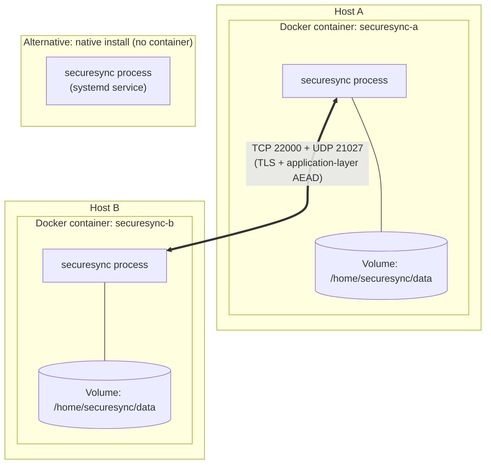

# Deployment

> Status: **Design** — meaningful once Phase 5 (Transfer Engine) and
> Phase 9 (CLI) exist. Documented now so the Dockerfile and
> docker-compose.yml scaffolding built in Phase 0.5 has a clear target.

## 1. Deployment diagram



SecureSync can run either as a native process (installed via `pip`) or as a
container — the Dockerfile packages the exact same application, there is no
container-specific code path.

## 2. Running with Docker Compose (local multi-peer demo)

```bash
docker compose up --build
```

`docker-compose.yml` starts two SecureSync instances (`securesync-a`,
`securesync-b`) on a shared bridge network, each with its own data volume
and config file under `examples/`. This is the fastest way to see two
peers discover and sync with each other without needing two physical
machines.

## 3. Running as a single container

```bash
docker build -t securesync:dev .
docker run -d \
  --name securesync \
  -p 22000:22000/tcp -p 21027:21027/udp \
  -v securesync-data:/home/securesync/data \
  -v ./config.yaml:/home/securesync/config.yaml:ro \
  securesync:dev
```

The image runs as a non-root user (`securesync`) — see the Dockerfile.

## 4. Running natively (systemd)

*(Example unit file — finalized once the CLI entry point exists in
Phase 9.)*

```ini
[Unit]
Description=SecureSync file synchronization daemon
After=network-online.target

[Service]
ExecStart=/usr/local/bin/securesync daemon --config /etc/securesync/config.yaml
Restart=on-failure
User=securesync

[Install]
WantedBy=multi-user.target
```

## 5. Ports

| Port | Protocol | Purpose |
|---|---|---|
| 21027 | UDP | Peer discovery (broadcast) |
| 22000 | TCP | Encrypted sync traffic (TLS + AEAD) |

Both are configurable — see `docs/configuration.md`.

## 6. Upgrading

*(Populated once the metadata database schema and protocol versioning are
implemented — Phases 5–8. Will cover: schema migrations, protocol
version negotiation between an upgraded and a not-yet-upgraded peer, and
rollback guidance.)*
