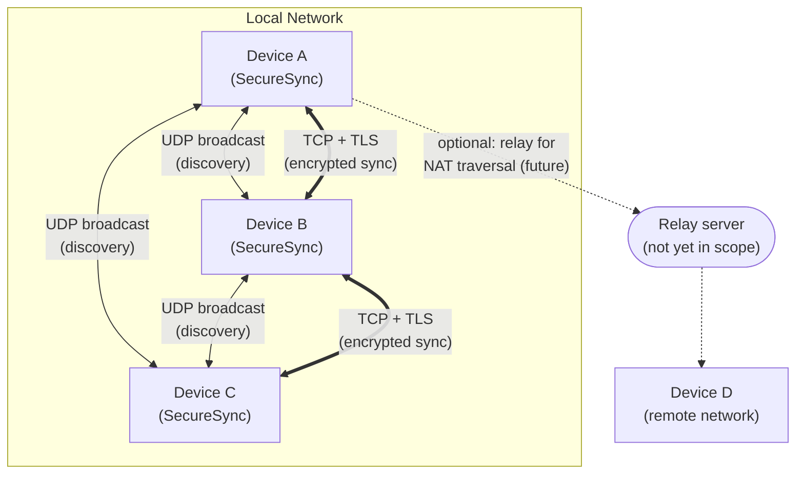
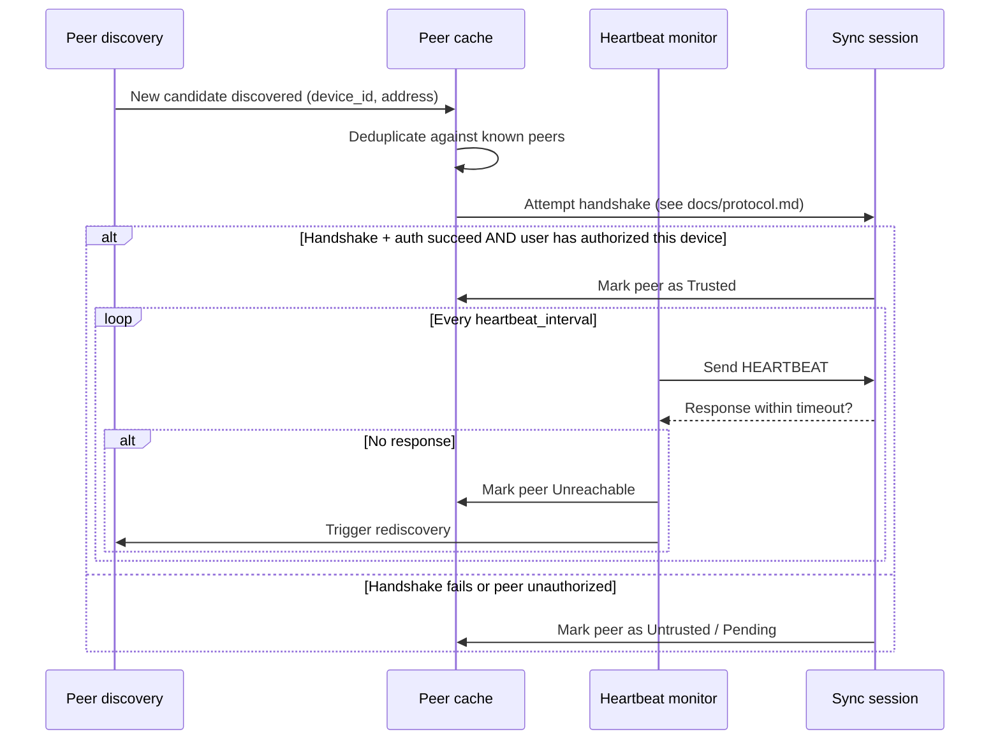

# Networking

> Status: **Design** — implemented in Phase 4 (Peer Discovery) and Phase 5
> (Transfer Engine).

## 1. Discovery mechanisms

SecureSync supports two complementary discovery mechanisms:

| Mechanism | Scope | How it works |
|---|---|---|
| UDP broadcast | Local subnet | Periodic broadcast announcement (device ID + fingerprint + listening port) on a well-known UDP port; peers on the same subnet respond directly |
| mDNS (`_securesync._tcp.local.`) | Local network, works across some VLAN configurations broadcast doesn't | Standard multicast DNS service advertisement, discoverable with generic mDNS tooling for debugging |

Both mechanisms only **announce presence** — no file metadata or sync data
is ever included in a discovery packet. A discovered device becomes a
*candidate* peer; it only becomes a *trusted* peer after the authentication
and authorization steps in `docs/security.md` §3.

## 2. Network topology

SecureSync is fully peer-to-peer for devices on the same broadcast domain.
Cross-network (WAN/NAT-traversed) sync is noted as a future relay-based
extension and is explicitly **not** part of the current roadmap phases —
see `ROADMAP.md`.

## 3. Peer lifecycle

## 4. Reconnect strategy

- Missed heartbeats beyond a configurable threshold mark a peer
  `Unreachable` (not removed — its trust state is preserved).
- Reconnection attempts use exponential backoff (base delay, multiplier,
  and cap all configurable — see `docs/configuration.md`) to avoid
  hammering a peer that's briefly offline or a network that's congested.
- A peer that returns via a *new* discovery announcement short-circuits the
  backoff timer and reconnects immediately.

## 5. Connection security

All data-plane connections (i.e. everything beyond discovery) are TCP with
TLS, and additionally wrapped in the application-layer AEAD scheme described
in `docs/security.md` — this is deliberate defense in depth: TLS protects
the transport, the application-layer encryption protects the data even if
the TLS layer were ever misconfigured or terminated by an intermediary.
