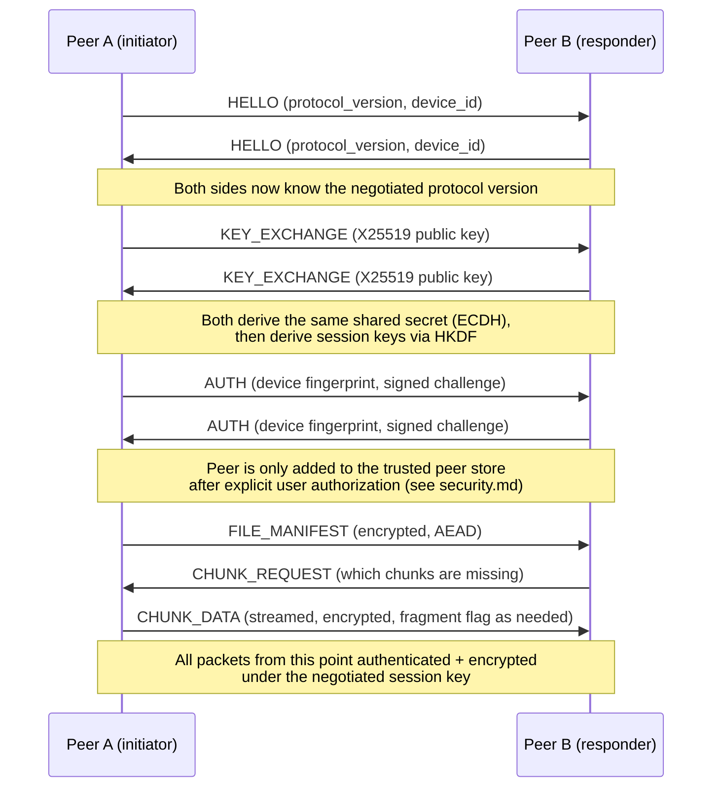

# Protocol

> Status: **Design** — this document specifies the target protocol before
> `core/protocol` is implemented (Phase 5). It exists now so the Transfer
> Engine, Peer Discovery, and Encryption phases are all built against one
> agreed-upon wire format instead of improvising it piecemeal.

## 1. Design goals

- **Small, fixed-size header** so a receiver can validate and route a
  packet before touching the (potentially large, streamed) payload.
- **Forward compatible** — a peer running a newer protocol version must be
  able to talk to an older one, or fail predictably rather than silently.
- **Payload format decoupled from the header** — the header is a raw,
  hand-packed binary struct (fixed layout, no ambiguity); the payload is
  MessagePack, so new fields can be added to messages without a protocol
  version bump.

## 2. Packet header layout

Fixed 32-byte header, big-endian:

| Field | Type | Size | Description |
|---|---|---|---|
| `magic` | `uint32` | 4 B | Constant `0x53594E43` (`"SYNC"`), rejects non-SecureSync traffic immediately |
| `version` | `uint8` | 1 B | Protocol version. Receivers reject packets with a `version` they don't support, per §4 |
| `packet_type` | `uint8` | 1 B | See §3 |
| `flags` | `uint16` | 2 B | Bitfield: bit 0 = compressed, bit 1 = encrypted, bit 2 = fragment, bits 3–15 reserved |
| `message_id` | `uint64` | 8 B | Unique per session; used to correlate requests/responses and detect replays |
| `payload_length` | `uint32` | 4 B | Length in bytes of the MessagePack payload that follows |
| `timestamp` | `uint64` | 8 B | Sender's Unix timestamp (ms) — replay-window checks, not a trust anchor by itself |
| `crc32` | `uint32` | 4 B | CRC32 over `payload`, integrity check *before* decryption/decompression |

Total: 32 bytes, followed by `payload_length` bytes of (optionally
compressed, optionally encrypted) MessagePack data.

```text
 0        4    5    6         8                        16
 +--------+----+----+---------+------------------------+
 | magic  |ver |type|  flags  |       message_id        |
 +--------+----+----+---------+------------------------+
 16                 20                    28            32
 +-------------------+---------------------+-----------+
 |  payload_length    |      timestamp      |   crc32   |
 +-------------------+---------------------+-----------+
 |                  payload (payload_length bytes)      |
 +--------------------------------------------------------+
```

## 3. Packet types

| Value | Name | Purpose |
|---|---|---|
| `0x01` | `HELLO` | Protocol/version announcement, first packet of a session |
| `0x02` | `KEY_EXCHANGE` | X25519 public key exchange (see `docs/security.md`) |
| `0x03` | `AUTH` | Peer/device authentication, fingerprint verification |
| `0x10` | `FILE_MANIFEST` | Announces a file and its chunk list |
| `0x11` | `CHUNK_REQUEST` | Requests one or more chunks by hash |
| `0x12` | `CHUNK_DATA` | Chunk payload (streamed, may be fragmented — see flag bit 2) |
| `0x20` | `HEARTBEAT` | Keep-alive / liveness check |
| `0x21` | `PEER_LIST` | Gossip of known peers (future: mesh discovery) |
| `0xF0` | `ERROR` | Structured error response |
| `0xFF` | `CLOSE` | Graceful session termination |

## 4. Versioning strategy

- The header's `version` field is a single monotonically increasing
  integer, not semver — the header layout itself only changes on a major,
  deliberately-announced protocol revision.
- Within one header version, **new payload fields are always additive** —
  MessagePack payloads are maps, so a newer sender can add optional keys
  that an older receiver simply ignores.
- A receiver that gets a packet with a higher `version` than it supports
  responds with `ERROR` (`unsupported_version`) rather than attempting to
  parse it — never guess.

## 5. Handshake sequence



## 6. Integrity and replay protection at the protocol layer

- `crc32` catches accidental corruption before spending cycles on
  decryption — it is **not** a security mechanism.
- Actual tamper-resistance comes from the AEAD tag once `flags` bit 1
  (encrypted) is set — see `docs/security.md`.
- `message_id` is a monotonically increasing counter per session; a
  receiver rejects any `message_id` it has already seen or one that falls
  outside the current replay window — see the Replay Attack row in
  `docs/security.md`.

## 7. Open questions (to resolve during Phase 5 implementation)

- Exact fragment reassembly strategy for `CHUNK_DATA` on very large files.
- Whether `PEER_LIST` gossip is in scope for the first Transfer Engine
  milestone or deferred to a later "mesh discovery" phase.
